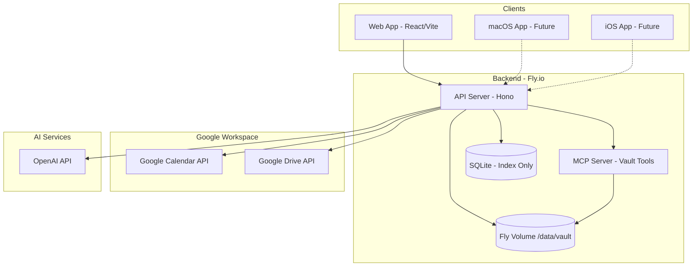
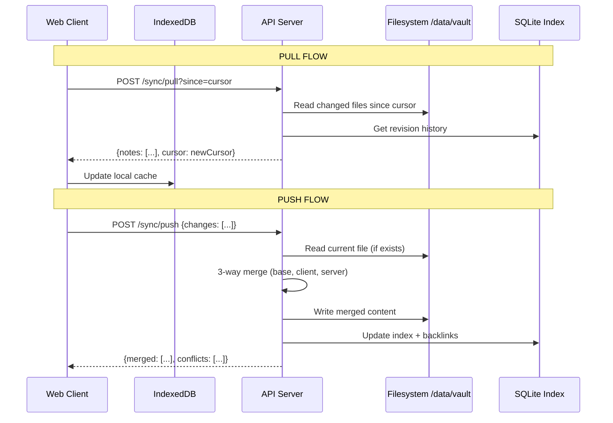

# Carbon - Local-First Markdown Notes App

Work in "/Users/maximilianwuhr/Obsidian/carbon"

## 1. Architecture Overview



## 2. Data Flow: Sync Algorithm



## 3. Merge Strategy

**Markdown files:**

- **3-way merge** when base revision available: `diff-match-patch` to compute patches from base→client and base→server, apply both
- **Patch merge fallback**: When no base, compute diff between server and client, apply client patches to server
- **Auto-merge default**: No conflict prompts; if merge fails structurally, keep both versions (`note.md` + `note.conflict.md`)

**Non-markdown files:**

- **Last-modified wins**: Compare `updatedAt` timestamps, keep newer version

## 4. Tech Stack (Single Option)

| Layer | Technology | Justification |

|-------|------------|---------------|

| **Monorepo** | pnpm workspaces + Turborepo | Fast, proven, good for shared packages |

| **Frontend** | React 19 + Vite | Fast HMR, modern React features |

| **UI** | shadcn/ui + Tailwind CSS | Radix primitives, themeable, Carbon aesthetic (accent: rgb(253, 185, 47)) |

| **Editor** | CodeMirror 6 | Text-first, extensible, good for wiki-links |

| **State** | Zustand + TanStack Query | Lightweight, works with sync patterns |

| **Local Store** | IndexedDB (Dexie) | Offline-first, queued sync |

| **Backend** | Hono (Bun runtime) | Fast, TypeScript-native, small footprint |

| **Validation** | Zod | Runtime + static types, OpenAPI generation |

| **Database** | SQLite (better-sqlite3) | Indexing only; fast, embedded |

| **MCP Server** | @modelcontextprotocol/sdk | Vault tools for AI context |

| **AI Chat** | Vercel AI SDK + OpenAI Agents SDK | Streaming, tool calling, provider-agnostic |

| **Auth** | Google OAuth 2.0 | Single-user MVP; tokens encrypted at rest |

| **Container** | Docker (node:22-alpine) | Small image, Fly.io compatible |

| **Deploy** | Fly.io + Fly Volume | Simple, persistent storage at /data/vault |

## 5. Repository Structure

```
/carbon
├── apps/
│   ├── web/                    # React + Vite frontend
│   │   ├── src/
│   │   │   ├── components/     # UI components (shadcn/ui)
│   │   │   ├── features/       # Feature modules
│   │   │   │   ├── editor/     # CodeMirror editor
│   │   │   │   ├── vault/      # Folder tree, note list
│   │   │   │   ├── workspace/  # GCal + GDrive panels
│   │   │   │   ├── chat/       # AI chat panel
│   │   │   │   └── daily/      # Daily note view
│   │   │   ├── lib/            # Utils, hooks
│   │   │   ├── styles/         # Tailwind + Carbon theme
│   │   │   └── pages/          # Routes (style-guide, etc.)
│   │   └── index.html
│   │
│   └── api/                    # Hono backend
│       ├── src/
│       │   ├── routes/         # API routes
│       │   │   ├── sync.ts     # /sync/pull, /sync/push
│       │   │   ├── notes.ts    # /notes CRUD
│       │   │   ├── files.ts    # /files upload/download
│       │   │   ├── calendar.ts # /calendar proxy
│       │   │   ├── drive.ts    # /drive proxy
│       │   │   └── chat.ts     # /chat streaming
│       │   ├── services/       # Business logic
│       │   ├── db/             # SQLite schema + queries
│       │   └── mcp/            # MCP server setup
│       └── Dockerfile
│
├── packages/
│   └── core/                   # Shared logic (web + future native)
│       ├── src/
│       │   ├── merge/          # diff-match-patch merge algorithms
│       │   ├── sync/           # Sync state machine, cursors
│       │   ├── vault/          # Vault model, path utilities
│       │   ├── links/          # Wiki-link parser, backlinks
│       │   └── schemas/        # Zod schemas (Note, File, SyncState)
│       └── tests/              # Unit tests for merge/sync
│
├── docs/
│   ├── architecture.md
│   ├── decisions.md            # ADRs
│   ├── dev-commands.md
│   ├── api.md                  # Generated OpenAPI
│   └── ai-playbook.md          # Patterns for AI-assisted dev
│
├── docker-compose.yml          # Local dev
├── fly.toml                    # Fly.io config
├── turbo.json
├── pnpm-workspace.yaml
└── README.md
```

## 6. Key Entities (Zod Schemas)

```typescript
// packages/core/src/schemas/note.ts
const NoteSchema = z.object({
  id: z.string().uuid(),
  path: z.string(),              // e.g., "Daily notes/2025-12-19.md"
  title: z.string(),
  markdown: z.string(),
  frontmatter: z.record(z.unknown()).optional(),
  updatedAt: z.string().datetime(),
  deviceId: z.string(),
  revision: z.string(),          // SHA-256 hash of content
  baseRevision: z.string().nullable(), // For 3-way merge
});

// packages/core/src/schemas/sync.ts
const SyncStateSchema = z.object({
  deviceId: z.string(),
  cursor: z.string(),            // Opaque cursor (timestamp-based)
  lastSyncAt: z.string().datetime(),
});
```

## 7. API Endpoints

| Method | Endpoint | Description |

|--------|----------|-------------|

| POST | `/sync/pull` | Fetch changes since cursor |

| POST | `/sync/push` | Push local changes, receive merged results |

| GET | `/notes/:path` | Get single note by path |

| PUT | `/notes/:path` | Create/update note |

| DELETE | `/notes/:path` | Delete note |

| GET | `/notes/search` | Full-text search |

| GET | `/notes/backlinks/:path` | Get notes linking to path |

| POST | `/files/upload` | Upload attachment |

| GET | `/files/:key` | Download attachment |

| GET | `/calendar/events` | List events (day/range) |

| GET | `/calendar/search` | Search events |

| GET | `/drive/files` | List/search Drive files |

| POST | `/chat` | Streaming AI chat |

| GET | `/auth/google` | OAuth initiate |

| GET | `/auth/google/callback` | OAuth callback |

## 8. UI Layout (Non-Negotiable)

```
┌─────────────────────────────────────────────────────────────────────────┐
│ Carbon                                                    [⚙️] [👤]     │
├────────────────┬──────────────────────────────────┬─────────────────────┤
│                │                                  │                     │
│  FOLDER TREE   │                                  │     AI CHAT         │
│  ─────────────│                                  │     ──────────      │
│  📁 Daily notes│         MARKDOWN EDITOR         │     [Context: ...]  │
│  📁 People     │                                  │                     │
│  📁 Meetings   │     Title: 2025-12-19           │     User: ...       │
│  📁 Ideas      │     ─────────────────────       │     AI: ...         │
│  ...           │     ## Meetings                 │                     │
│                │     - 10:30 [[Meeting]]...      │                     │
│  NOTE LIST     │                                  │                     │
│  ─────────────│                                  │                     │
│  🗒️ 2025-12-19 │     [Edit] [Preview] [Split]    │                     │
│  🗒️ 2025-12-18 │                                  │                     │
│                │                                  │     [Type message]  │
├────────────────┤                                  ├─────────────────────┤
│ WORKSPACE      │                                  │                     │
│ ──────────────│                                  │                     │
│ [📅 Calendar]  │                                  │                     │
│ [📁 Drive]     │                                  │                     │
│                │                                  │                     │
│ Today's Events │                                  │                     │
│ ─────────────│                                  │                     │
│ 10:30 OKR Day  │                                  │                     │
│ 13:00 Onboard  │                                  │                     │
│ [Insert Agenda]│                                  │                     │
└────────────────┴──────────────────────────────────┴─────────────────────┘
```

## 9. Google Integration (MVP)

**OAuth Flow:**

1. User clicks "Connect Google"
2. Redirect to Google OAuth consent (scopes: calendar.readonly, drive.readonly)
3. Callback stores encrypted tokens in SQLite
4. Tokens refreshed automatically

**Calendar Actions:**

- `GET /calendar/events?date=2025-12-19` → List day's events
- `GET /calendar/search?q=OKR` → Search events
- "Insert Agenda" button formats events as Markdown and inserts at cursor

**Drive Actions:**

- `GET /drive/files?q=budget` → Search files
- `GET /drive/files/recent` → Recent files
- "Insert Link" creates [`filename`](driveUrl) at cursor

## 10. Wiki-Links + Slash Commands

**Link Syntax (Obsidian-compatible):**

- `[[Note]]` → Link to note
- `[[Note|Alias]]` → Link with display text
- `[[Note#Heading]]` → Link to heading
- `![[Note]]` → Embed (v2)

**Slash Commands (/ menu):**

- `/daily` → Create/open today's daily note
- `/meeting` → Create meeting note from GCal event picker
- `/template:person` → Insert person template
- `/agenda` → Insert today's calendar agenda
- `/drive` → Open Drive picker, insert link
- `/summarize` → AI summarize current note
- `/tasks` → AI extract tasks from note

## 11. Milestones

### M0: Repo Scaffold + Style Guide + Layout (Days 1-2)

- Initialize pnpm monorepo with Turborepo
- Setup apps/web with Vite + React + shadcn/ui
- Setup apps/api with Hono + Bun
- Setup packages/core with TypeScript
- Implement Carbon theme (Teenage Engineering + Bauhaus aesthetic)
  - Accent color: `rgb(253, 185, 47)`
- Build Style Guide page showing all components
- Implement 4-panel layout shell (no functionality)

**Acceptance:** `pnpm dev` runs both apps; Style Guide page renders all components

### M1: File-Based Vault + Folder Tree + Note CRUD (Days 3-5)

- Implement filesystem adapter in apps/api
- SQLite schema for note index + backlinks
- Folder tree component with expand/collapse
- Note list with sorting
- CodeMirror editor with Markdown syntax
- Wiki-link parsing + syntax highlighting
- Create/read/update/delete notes via API

**Acceptance:** Can navigate folders, create notes, edit with wiki-links, see backlinks

### M2: Sync Engine + Merge + Attachments (Days 6-8)

- Implement diff-match-patch merge in packages/core
- 3-way merge when base revision exists
- Patch merge fallback
- IndexedDB local store with dirty queue
- Sync pull/push endpoints
- Attachment upload (last-write-wins)
- Conflict handling (keep both versions)

**Acceptance:** Two browser tabs sync changes; merge handles concurrent edits

### M3: Google OAuth + Calendar Panel + Daily Agenda (Days 9-11)

- Google OAuth flow (single-user)
- Encrypted token storage
- Calendar events endpoint (day view, search)
- Workspace panel UI (bottom-left)
- "Insert Agenda" formats events as Markdown (matching /wuehr pattern)
- Daily Note view with integrated agenda

**Acceptance:** Connect Google, view today's events, insert formatted agenda into daily note

### M4: Drive Panel + AI Chat + Deploy (Days 12-14)

- Drive files endpoint (search, recent)
- Drive tab in Workspace panel
- "Insert Drive Link" action
- AI chat panel with streaming
- Chat context: current note, selected text, workspace items
- MCP server exposing vault tools
- Docker build + fly.toml
- Deploy to Fly.io with volume mount

**Acceptance:** Can search Drive, insert links; AI chat references notes; deployed on Fly.io

## 12. Deployment Commands

```bash
# Install Fly CLI
curl -L https://fly.io/install.sh | sh

# Login
fly auth login

# Create app
fly apps create carbon-notes

# Create volume (1GB for MVP)
fly volumes create vault_data --region fra --size 1

# Deploy
fly deploy

# Open app
fly open
```

## 13. fly.toml

```toml
app = "carbon-notes"
primary_region = "fra"

[build]
  dockerfile = "apps/api/Dockerfile"

[env]
  NODE_ENV = "production"
  VAULT_PATH = "/data/vault"
  DATABASE_PATH = "/data/carbon.db"

[mounts]
  source = "vault_data"
  destination = "/data"

[[services]]
  internal_port = 3000
  protocol = "tcp"

  [[services.ports]]
    port = 80
    handlers = ["http"]

  [[services.ports]]
    port = 443
    handlers = ["tls", "http"]

  [[services.http_checks]]
    path = "/health"
    interval = 10000
    timeout = 2000
```

## 14. Future: Native Apps

**macOS: Tauri**

**iOS: React Native/Expo**

**Migration Path:**

1. packages/core compiles to both ESM and WASM (via wasm-pack for Rust port if needed)
2. Native apps own local filesystem vault
3. Same API serves as sync hub
4. Native apps call same /sync/pull and /sync/push endpoints

# Appendix

## Vault Inspection Summary: /wuehr Patterns

### Folder Structure

| Folder | Count | Purpose |

|--------|-------|---------|

| `Daily notes/` | 164 | Daily journal entries, YYYY-MM-DD.md format |

| `People/` | 182 | CRM-style person notes with auto-research |

| `Organizations/` | 65 | Company/organization profiles |

| `Meetings/` | 61 | Meeting notes organized by month subdirs |

| `Locations/` | 15 | Location-based notes |

| `FINN/` | 12 | Project-specific folder |

| `Ideas/` | 4 | Captured ideas |

| `Inbox/` | 5 | Quick capture landing zone |

| `Z_Settings & Tools/Templates/` | 8 | Note templates |

### Daily Note Pattern

```markdown
* ## [[Daily note]]
  - **Grateful for**
    - 
  - **Priorities**
    - 
  - **Daily habits**
    - Be present. In every meeting. In every second.
## Meetings
- 10:30 – [[Meetings/2025-12/Meeting Title ~eventid|Meeting Title]] with [[People/Name|Name]]
## Thoughts & Work
* 
```

**Key insights:**

- Time-prefixed meeting entries sourced from Google Calendar
- Wiki-links with aliases `[[path|Display Name]]`
- GCal event ID embedded in meeting filename (e.g., `~5cdrddn0cuid71btcnljarloqe`)
- Attendee links to People notes

### Meeting Template Pattern

```yaml
---
date: 2025-12-19
event_id: abc123
organizer: email@example.com
title: Meeting Title
start: 2025-12-19T10:00:00+01:00
end: 2025-12-19T11:00:00+01:00
meet_url: https://meet.google.com/xxx
attendees:
  - "[[People/Name|Name]]"
---
# Meeting Title
**Description:** ...

## My agenda 
**Primary Objective**: 
- 

## Notes
- 

## Agreed follow-up actions
```

### Templates Worth Implementing

| Template | Purpose |

|----------|---------|

| **Daily note** | Gratitude, priorities, agenda, thoughts |

| **Meeting** | GCal metadata, attendees, notes, actions |

| **People** | CRM fields + auto-research hook |

| **Organization** | Company profiles |

### Naming/Date Conventions

- Daily notes: `YYYY-MM-DD.md`
- Meetings: `Title ~eventid.md` (organized in `YYYY-MM/` subdirs)
- People: `Full Name.md`
- Organizations: `Company Name.md`

---